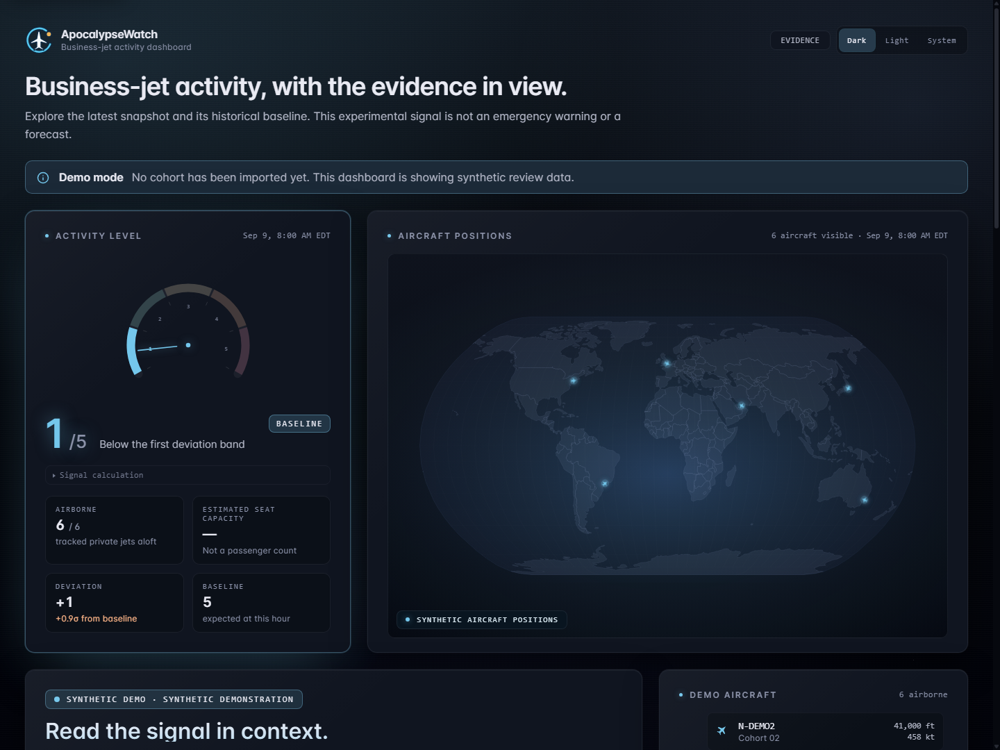
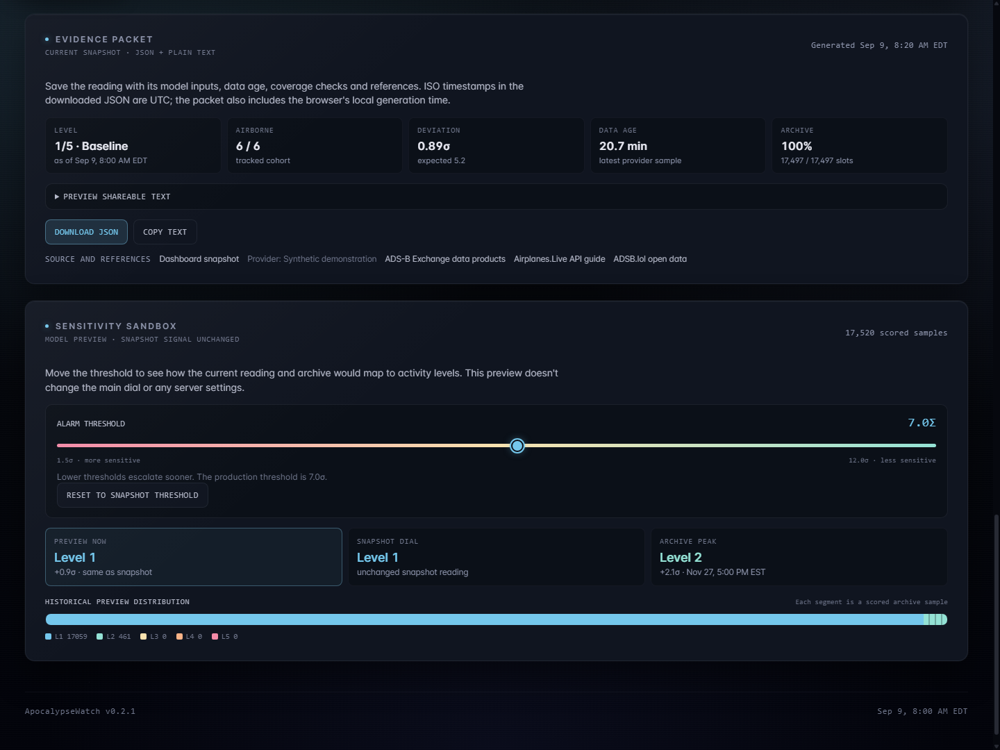

# ApocalypseWatch

[](https://github.com/SysAdminDoc/ApocalypseWatch/releases/latest) [](LICENSE) [](#run-it-locally)

Business-jet activity, with the evidence in view.

ApocalypseWatch puts a cohort's aircraft positions beside an experimental activity signal. Explore the historical baseline, check the age of the data and download the calculation inputs behind a reading.

It's a visualization, not an emergency warning system. Aircraft activity doesn't establish who is aboard, where they're going or why they're flying. A high reading is not a prediction of a crisis.

[Download v0.2.1](https://github.com/SysAdminDoc/ApocalypseWatch/releases/tag/v0.2.1) · [Run it locally](#run-it-locally) · [User guide](guide/README.md)



*The screenshots use the application's synthetic demonstration. They don't show real flights or a current event.*

## Start with the evidence

- The activity dial shows the observed count and expected baseline together. Open **Signal calculation** for the inputs.
- A world map and altitude-sorted aircraft list show the positions available in the snapshot.
- Switch the history chart between 24 hours and a year. A table shows the last 48 samples in the chosen range, and the coverage calendar makes gaps and stale data visible.
- Export a JSON evidence packet or copy its text. Both include source information and the data mode. The sensitivity slider is a local experiment; it doesn't change the server's threshold.

Dark and light themes are included. A compact `?embed` view is available for static hosting; self-hosted embedding depends on your server's frame policy.



## Run it locally

To try the interface without installing project dependencies, download [the demonstration ZIP](https://github.com/SysAdminDoc/ApocalypseWatch/releases/download/v0.2.1/ApocalypseWatch-v0.2.1-demo.zip). Extract it, run `node serve.cjs`, then open [127.0.0.1:3030](http://127.0.0.1:3030). It requires Node.js 24 or newer and uses synthetic data only. After downloading Node and the package, it works without internet while the local server is running.

Want the backend and collection tools? The [source ZIP](https://github.com/SysAdminDoc/ApocalypseWatch/releases/download/v0.2.1/ApocalypseWatch-v0.2.1-source.zip) includes the code and visual archive. You can also clone the repository:

Use Node.js 24 or newer. From a fresh checkout:

```sh
git clone https://github.com/SysAdminDoc/ApocalypseWatch.git
cd ApocalypseWatch
npm ci
npm run dev
```

Open [localhost:5173](http://localhost:5173). The API runs on port 3030. An empty database starts in synthetic demo mode, with data downloads and notifications inactive. You don't need a provider account to try the interface.

Already have a configured database? Starting its server can refresh provider data and send any notifications you've configured. Use a fresh checkout or the separate demonstration download to keep that state untouched.

For build modes, downloadable packages and deployment instructions, see the [maintainer guide](guide/development/README.md).

## Understand the reading

The local backend uses time-of-day and weekday patterns from up to 28 days of historical samples. It compares an observed concurrent count with the expected count and standard deviation. The configured sigma threshold sets the top band; the lower bands divide that threshold into quarters.

A static deployment displays whatever model values its configured snapshot supplies. Check the source and timestamps before comparing readings across deployments. A successful page load doesn't prove that the underlying data is current.

Seat capacity is an estimate, not an occupancy count. Missing ADS-B coverage, delayed feeds or an incomplete cohort can change the result. Don't use this project for emergency decisions, navigation or identifying an aircraft's passengers.

## Use measured data

The self-hosted pipeline includes an FAA cohort importer and ADS-B history tools. Python 3.10 or newer and the packages in `requirements.txt` are needed for that route. Importing data writes to the local SQLite database and can require substantial downloads.

The static site reads an upstream public snapshot. It doesn't run an independent collection service. Provider access, availability and data-use terms remain separate from this repository's MIT software license.

[Configure a data source](guide/development/README.md#data-sources) before running import or refresh commands. Notification integrations are optional and require their own configuration. They aren't part of the offline demonstration.

## Build and check

```sh
npm test
npm run lint
npm run build
```

The root workspace lockfile controls dependency installation. The browser shell supports home-screen installation, but live snapshots require a working data source. No general offline-data guarantee is made.

## Credit and license

ApocalypseWatch is an independent interface derived from [Kyle McDonald's Early Warning System](https://github.com/kylemcdonald/ews). The server and ingestion tools also carry local changes; they are not an unchanged upstream copy.

The software is [MIT licensed](LICENSE). See [NOTICE](NOTICE) for attribution. Original artwork, the prior README and every review attempt are preserved in the [concept archive](assets/concepts/2026-09-09-marketing/README.md).
