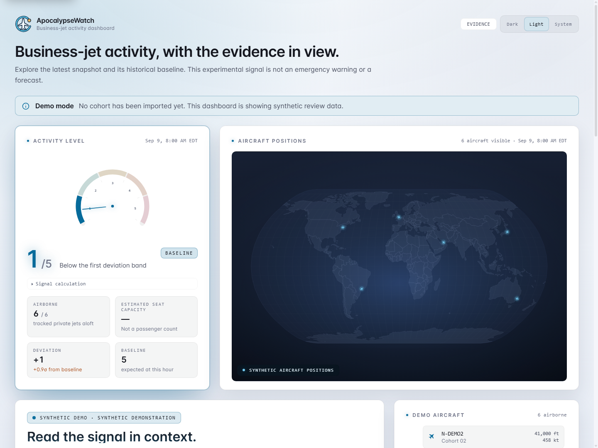
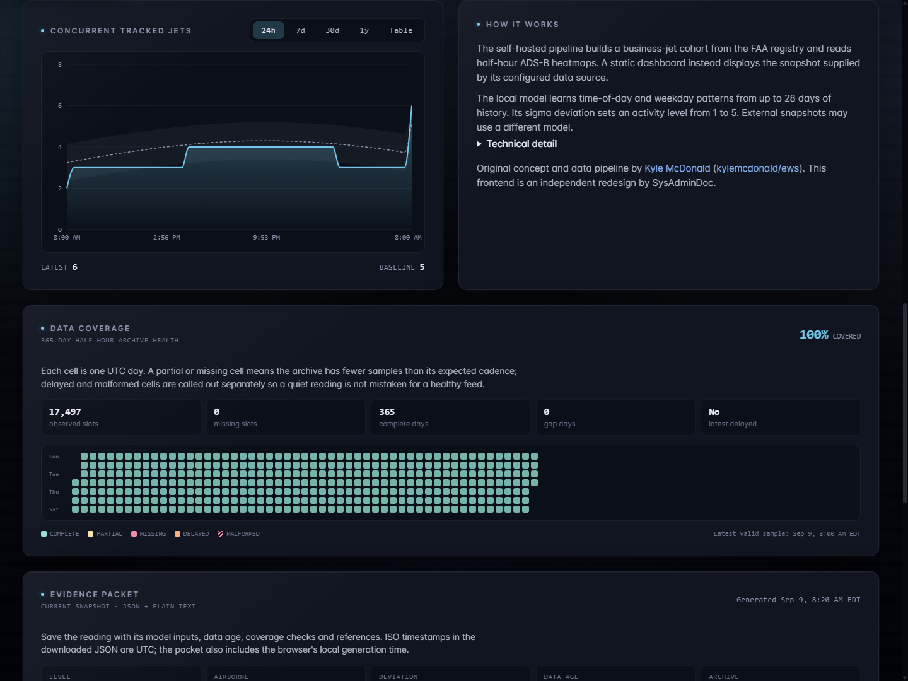
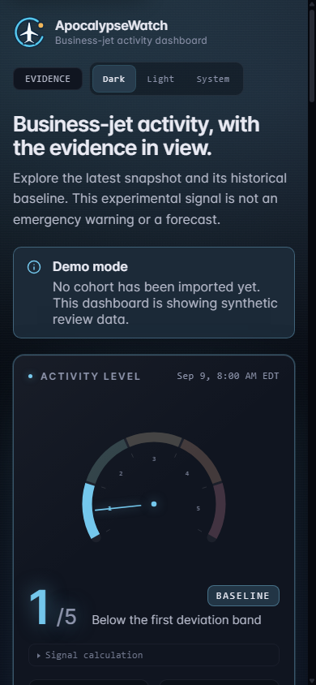

# ApocalypseWatch v0.2.1 screenshots

These are unretouched browser captures of the built application and its actual local API, using an empty, isolated database. All displayed aircraft and history are synthetic. No real-flight information or user database was used.

The selected captures and their original hashes are in [the presentation review](../concepts/2026-09-09-marketing/README.md). Both themes and 320-pixel and 390-pixel layouts were checked. The README favors the dark desktop overview because the activity reading, source notice and map are visible together.

